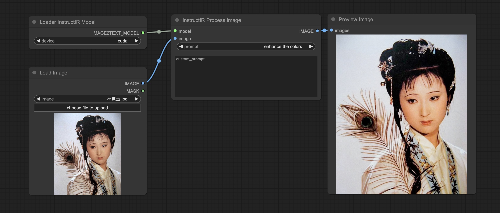

# ComfyUI for InstructIR: Enhancing Image Restoration

Welcome to the ComfyUI plugin for InstructIR, an innovative solution designed to revolutionize the way we improve images using human instructions. With its advanced neural model, InstructIR excels in performing comprehensive image restoration, setting new benchmarks across various tasks. Whether it's removing noise, clearing rain, sharpening blurry images, dissipating haze, or enhancing low-light photos, InstructIR delivers exceptional results.

https://github.com/mv-lab/InstructIR



## Installation Instructions
To integrate ComfyUI with InstructIR into your projects, follow these simple steps:
```
git clone https://github.com/zhongpei/ComfyUI-InstructIR custom_nodes/ComfyUI-InstructIR
```

## Crafting Your Instruction
InstructIR simplifies the restoration process by understanding a wide range of human-written prompts. Whether you're looking to denoise, deblur, dehaze, derain, enhance resolution, or improve overall image quality, the model comprehends and executes your instructions with precision. Here are examples of prompts you can use for different restoration needs:

### Denoising
- "Help me reduce the fuzziness in this image."
- "I need this image denoised ASAP."
- "Clean up this noisy image, it's an eyesore."

### Deblurring
- "Please, clean up this blurry photo."
- "My picture's not sharp, fix it."
- "Deblur my picture, it's too fuzzy."

### Dehazing
- "Please, fix the haziness in my image."
- "I need to remove the haziness from this image."
- "Get rid of the fog in my image."

### Deraining
- "I want to eliminate the water from this image."
- "Clear the rain from my picture."
- "Can you get rid of the raindrops in my picture?"

### Super Resolution (SR)
- "I need to enhance the size and quality of this image."
- "My photo is lacking size and clarity; can you improve it?"
- "I'd appreciate it if you could upscale this photo."

### Ambiguous Instructions
- "Please, clear up the mess on this image."
- "I want this image to look good."
- "Make it pop."

### Low-Light (LOL) Enhancement
- "I took this photo during the night, enhance it."
- "The photo is too dark, improve exposure."
- "Can you make the image brighter?"

### General Enhancement
- "Make my image look like DSLR quality."
- "Improve the colors of my image."
- "Can you edit this to look like an award-winning photo?"

Embrace the power of ComfyUI for InstructIR to transform your images with simple, intuitive commands.


# ComfyUI for InstructIR：图像恢复增强插件

欢迎使用ComfyUI for InstructIR，这是一个创新的插件，旨在通过人类指令改善图像处理方式。InstructIR通过其先进的神经模型，在各种图像恢复任务中表现出色，设定了新的标准。无论是去噪、去雨、锐化模糊图像、消除雾霾还是增强低光照照片，InstructIR都能提供卓越的结果。

https://github.com/mv-lab/InstructIR


## 安装指南
要将ComfyUI与InstructIR集成到您的项目中，请按照以下简单步骤操作：
```
git clone https://github.com/zhongpei/ComfyUI-InstructIR custom_nodes/ComfyUI-InstructIR
```

## 编写您的指令
InstructIR通过理解各种人类编写的提示来简化恢复过程。无论您是希望去除噪声、清晰化模糊图像、消除雾霾、去除雨滴、提高分辨率还是改善整体图像质量，模型都能准确理解并执行您的指令。以下是您可以用于不同恢复需求的提示示例：

### 去噪
- "Help me reduce the fuzziness in this image."
- "I need this image denoised ASAP."
- "Clean up this noisy image, it's an eyesore."

### 去模糊
- "Please, clean up this blurry photo."
- "My picture's not sharp, fix it."
- "Deblur my picture, it's too fuzzy."

### 去雾
- "Please, fix the haziness in my image."
- "I need to remove the haziness from this image."
- "Get rid of the fog in my image."

### 去雨
- "I want to eliminate the water from this image."
- "Clear the rain from my picture."
- "Can you get rid of the raindrops in my picture?"

### 超分辨率（SR）
- "I need to enhance the size and quality of this image."
- "My photo is lacking size and clarity; can you improve it?"
- "I'd appreciate it if you could upscale this photo."

### 模糊指令
- "Please, clear up the mess on this image."
- "I want this image to look good."
- "Make it pop."

### 低光增强（LOL）
- "I took this photo during the night, enhance it."
- "The photo is too dark, improve exposure."
- "Can you make the image brighter?"

### 一般增强
- "Make my image look like DSLR quality."
- "Improve the colors of my image."
- "Can you edit this to look like an award-winning photo?"

借助ComfyUI for InstructIR的力量，通过简单直观的命令转换您的图像。